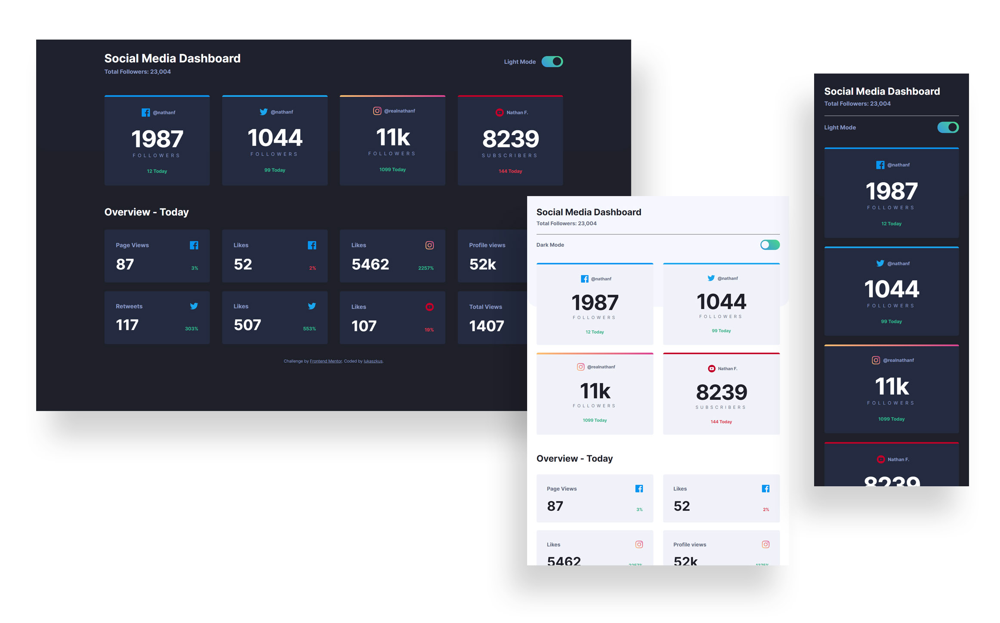

# Frontend Mentor - Social media dashboard with theme switcher solution

This is a solution to the [Social media dashboard with theme switcher challenge on Frontend Mentor](https://www.frontendmentor.io/challenges/social-media-dashboard-with-theme-switcher-6oY8ozp_H).

## Table of contents

- [Overview](#overview)
  - [The challenge](#the-challenge)
  - [Screenshot](#screenshot)
  - [Links](#links)
- [My process](#my-process)
  - [Built with](#built-with)
- [Author](#author)

## Overview

### The challenge

Users should be able to:

- View the optimal layout for the site depending on their device's screen size
- See hover states for all interactive elements on the page
- Toggle color theme to their preference

### Screenshot

### Links

- Solution URL: [https://www.frontendmentor.io/solutions/social-media-dashboard-using-sass-flexbox-js-sTVu9mnaE](https://www.frontendmentor.io/solutions/social-media-dashboard-using-sass-flexbox-js-sTVu9mnaE)
- Live Site URL: [https://lukaszkus.github.io/social-media-dashboard/](https://lukaszkus.github.io/social-media-dashboard/)

## My process

### Built with

- Semantic HTML5 markup
- [Sass](https://sass-lang.com/) - CSS extension
- BEM methodology
- Flexbox
- Mobile-first workflow
- [Gulp](https://gulpjs.com/) - Task runner
- Vanilla JS

## Author

- Frontend Mentor - [@lukaszkus](https://www.frontendmentor.io/profile/lukaszkus)
